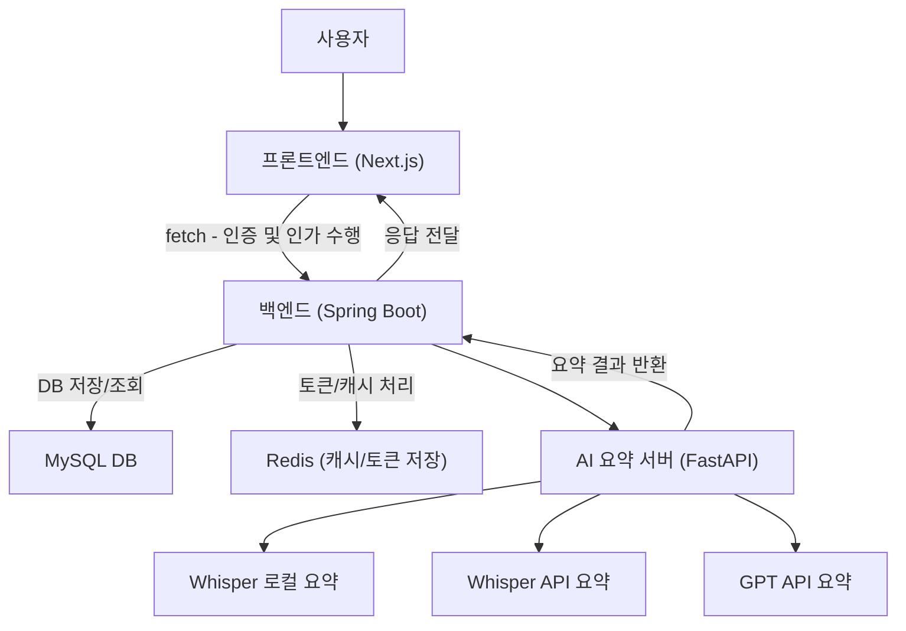

# AiLectureSummary

AI 기반 강의 요약 시스템

## 📦 프로젝트 구조

```
AiLectureSummary/
├── backend/     # Spring Boot 기반 백엔드 API
├── frontend/    # Next.js 기반 프론트엔드
├── fastapi/     # Whisper 기반 AI 요약 서버
├── .env.*       # 환경 변수 설정 파일들
├── docker-compose.dev.yml
└── docker-compose.prod.yml
```

## 🔗 배포 링크

- 프론트엔드: https://aisummarymono.vercel.app/
- Swagger 문서: https://aisummarymono.vercel.app/api 

## 🔧 주요 기술 스택

- **Frontend**: Next.js, React, TypeScript  
- **Backend**: Java 17, Spring Boot, Gradle  
- **AI**: FastAPI, Whisper  
- **Database**: MySQL 8  
- **Cache**: Redis  
- **DevOps**: Docker, Docker Compose

## 전체 아키텍쳐 흐름



