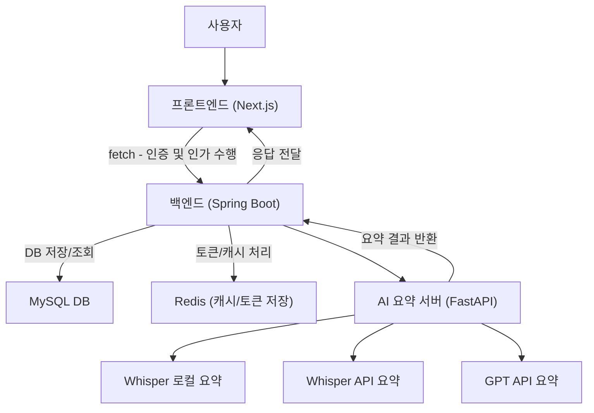
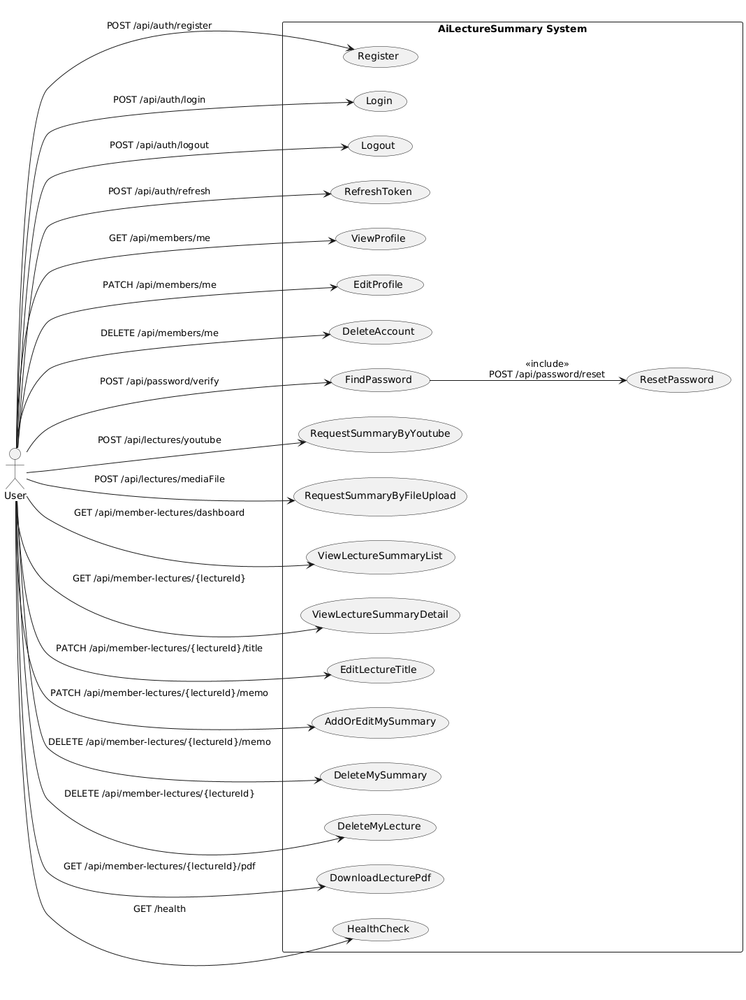
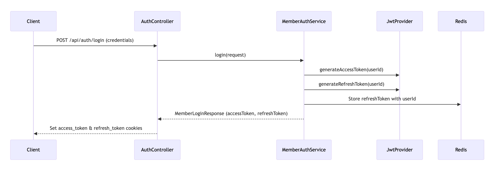
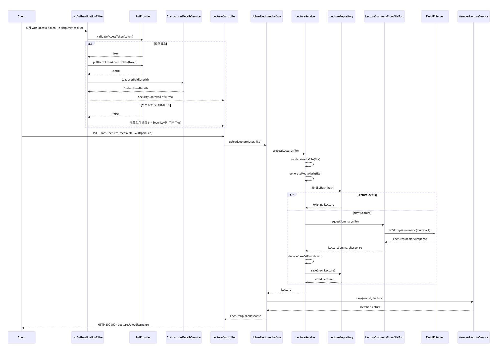
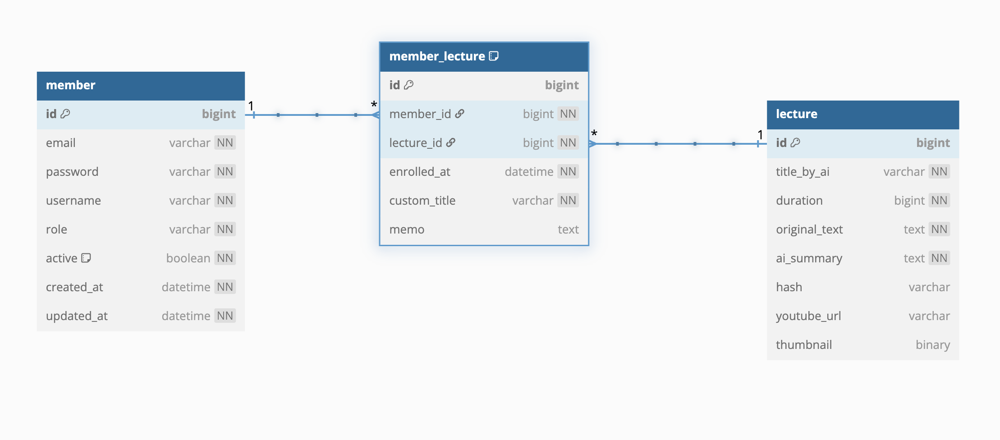
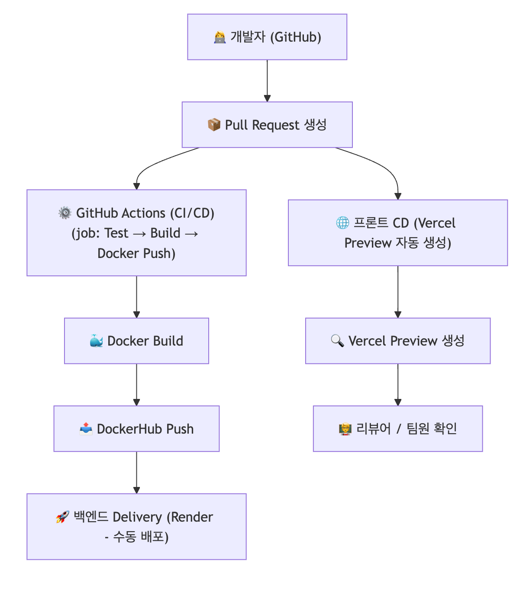

# AiLectureSummary

AI 기반 강의 요약 시스템
본 프로젝트는 **[한국교통대학교/데이터사이언스학과] 졸업 프로젝트**로 진행된 AI 기반 강의 요약 시스템입니다. 강의 음성 파일 및 영상 파일을 직접 업로드하거나 YouTube URL 입력만으로 해당 강의의 내용을 자동으로 요약하여 제공합니다. 사용자들은 이를 통해 학습 효율을 높이고, 강의 자료를 더 쉽게 관리하며, 필요한 강의 내용을 손쉽게 이해할 수 있습니다.

---

## 🧑‍💻 팀원

* **김서연**:
* **장준호**:
* **조희성**:
* **최민우**:

---

## 🗓️ 개발 기간

* **시작일**: 2024년 3월 7일
* **종료일**: 2024년 6월 13일

---
## 📦 프로젝트 구조

```
AiLectureSummary/
├── backend/     # Spring Boot 기반 백엔드 API
├── frontend/    # Next.js 기반 프론트엔드
├── fastapi/     # Whisper 기반 AI 요약 서버
├── .env.*       # 환경 변수 설정 파일들
├── docker-compose.dev.yml
└── docker-compose.prod.yml
```

---

## 🔗 배포 링크

- 서비스 바로가기: https://aisummarymono.vercel.app/
- API 문서 (Swagger): https://spring-backend-sp5x.onrender.com/swagger-ui/index.html

---

## 🔧 주요 기술 스택

- **Frontend**: Next.js, React, TypeScript  
- **Backend**: Java 17, Spring Boot, Gradle  
- **AI**: FastAPI, Whisper  
- **Database**: MySQL 8  
- **Cache**: Redis  
- **DevOps**: Docker, Docker Compose

---

## 전체 아키텍쳐 흐름



---

## 유스케이스 다이어그램


## 시퀀스 다이어그램
핵심 기능 (로그인, 강의 요약)
### 로그인

### 강의 요약


## ERD


## CI/CD



